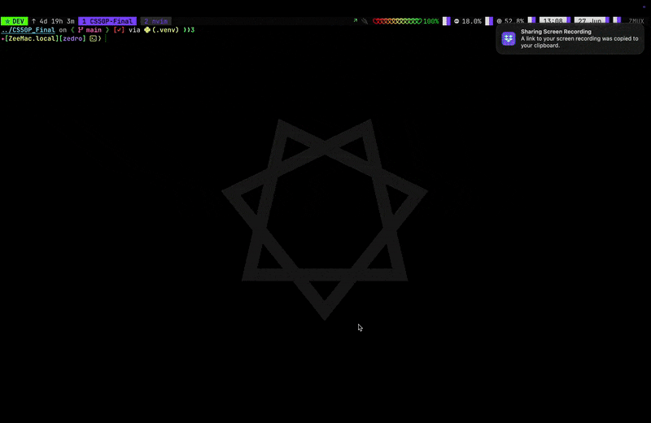

# CS50P_Final

## Video Demo



## Description

This is the final project for CS50P (CS50’s Introduction to Programming with Python). 
The project is designed to interact with the Discogs API, providing a terminal-based
interface for music data exploration and management. It leverages modern Python
tools for both API interaction and command-line usability.

## Project Structure

```
CS50P_Final/
│
├── dimms_posting/         # (Requests cache)
├── LICENSE                # Project license file
├── Makefile               # Automation commands for building/running/testing
├── project.py             # Main application entry point
├── pytest.ini             # Pytest configuration for running tests
├── README.md              # Project documentation (this file)
├── requirements.txt       # Python dependencies
├── scripts/
│   ├── build.sh           # Shell script to build the project
│   ├── run.sh             # Shell script to run the project
│   └── thx-bye.sh         # Shell script to say goodbye
└── test_project.py        # Test suite for the project
```

## Features

- **Discogs API Integration:** Fetch and manage music data using the [Discogs API](https://www.discogs.com/developers).
- **Terminal Interface:** User-friendly command-line experience powered by [Typer](https://typer.tiangolo.com/)
and [Rich-CLI](https://github.com/Textualize/rich-cli).
- **Testing:** Automated tests with pytest.
- **Scripts:** Shell scripts for building and running the project.

## Installation

1. Clone the repository:

   ```sh
   git clone git@github.com:PedroZappa/CS50P_Final.git
   cd CS50P_Final
   ```


2. Source .venv environment:

   ```sh
   source .env && source .venv/bin/activate
   ```

3. Install dependencies:

   ```sh
   pip install -r requirements.txt
   ```

## Usage

- To run the main application:

  ```sh
  python project.py
  # For interactive mode
  python project.py -i
  ```

- See all available commands

  ```sh
  make help
  ```

## Docs

### API

- [Discogs Developers](https://www.discogs.com/developers)

### Terminal Interface

- [Rich-CLI](https://github.com/Textualize/rich-cli)
- [Typer](https://typer.tiangolo.com/)
- [prompt_toolkit](https://python-prompt-toolkit.readthedocs.io/en/master/)
- [requests-rache](https://pypi.org/project/requests-cache/)

## License

See [LICENSE](LICENSE) for details.
